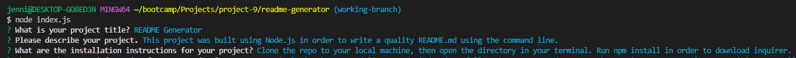
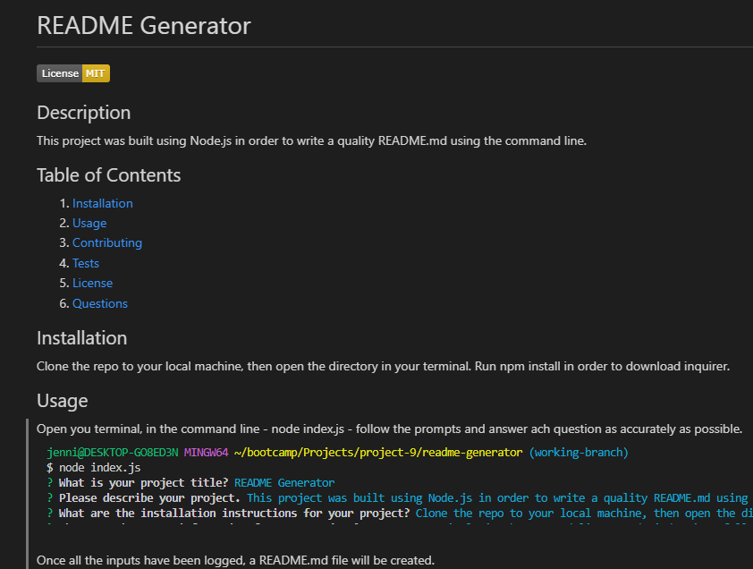

  
# README Generator

## Description 
This project was built using Node.js to write a quality README.md using the command line. The README for this project was created using the README Generator.

## Table of Contents
1. [Installation](#installation)
2. [Usage](#usage)
3. [Contributing](#contributing)
4. [Tests](#tests)
5. [License](#license)
6. [Questions](#questions)

## Installation
Clone the repo to your local machine, then open the directory in your terminal. Run npm install to download inquirer.

## Usage
Open the terminal, in the command line type - node index.js - follow the prompts and answer each question as accurately as possible. 
  
Once all the inputs have been logged, a README.md file will be created.  
  
For an example of the process, please view this video: [Demo Video](https://drive.google.com/file/d/13W9M-YFdAAKIoF0o4y3P4_CS0wFtT-5P/view)

## Contributing
N/A

## Tests
N/A

## License
Licensed under the [MIT license](https://opensource.org/license/mit/)

## Questions
You can view my GitHub profile here: [JenWariner19](https://github.com/JenWariner19) 
If you have any questions and would like to contact me, you can email me at: [jenniferwariner@yahoo.com](mailto:jenniferwariner@yahoo.com)
